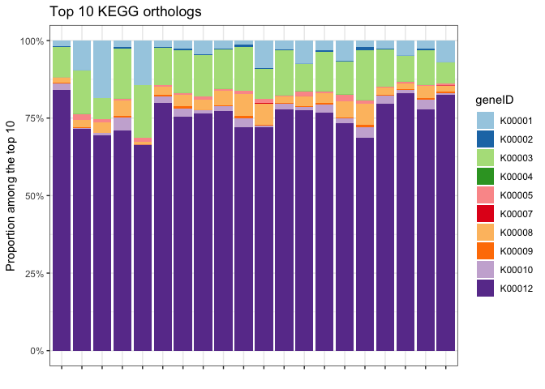

Waldo examples
================

# Introduction

[Waldo](https://www.tidyverse.org/blog/2020/10/waldo/) was originally
created as a tool for testing equality of objects when developing R
packages [(see
`testthat::expect_equal()`)](https://testthat.r-lib.org/reference/equality-expectations.html).
The purpose of the main function
[`compare()`](https://rdrr.io/cran/waldo/man/compare.html) is to
determine the difference between two R objects and display them. That
way, if there are differences, the test will fail and one can determine
the source of the bug. However, could we not use this function to
ascertain differences in data sets?

## Metadata

A common problem is that we have a matrix of say, KEGG ortholog counts,
and a data-frame full of samples. NB: This is example data from a mouse
project.

``` r
my_data <- read_tsv("data_matrix.tsv", show_col_types = FALSE)
my_samples <- read_tsv("sample_sheet.tsv", show_col_types = FALSE)
```

### Subsetting

A common practice is to subset the data to “drill-down” to pertinent
details. We might filter out the controls or just look at the top 10
genes in a dataset.

Like so:

``` r
my_subset <- my_data %>%
  group_by(geneID) %>%
  summarise(sum_count = sum(count)) %>%
  slice(1:10) %>%
  left_join(my_data, by = "geneID") %>%
  select(SampleID, count, geneID)

my_subset %>%
  ggplot(aes(x = SampleID, y = count, fill = geneID)) +
  geom_bar(stat = "identity", position = "fill") +
  theme_bw() +
  theme(axis.text.x = element_blank(), strip.background = element_blank()) +
  scale_fill_brewer(palette = "Paired") +
  scale_y_continuous(labels = scales::percent) +
  labs(title = "Top 10 KEGG orthologs",
       y = "Proportion among the top 10",
       x = "")
```

<!-- -->

## Which ones changed?

With Waldo, we can quickly determine which genes were left out and which
ones were kept:

``` r
waldo::compare(unique(my_data$geneID), unique(my_subset$geneID))
```

    ##      old      | new                     
    ##  [8] "K00009" | "K00009" [8]            
    ##  [9] "K00010" | "K00010" [9]            
    ## [10] "K00012" | "K00012" [10]           
    ## [11] "K00013" -                         
    ## [12] "K00014" -                         
    ## [13] "K00015" -                         
    ## [14] "K00016" -                         
    ## [15] "K00018" -                         
    ## [16] "K00019" -                         
    ## [17] "K00020" -                         
    ##  ... ...        ...      and 83 more ...

Compare this with using, say, `setdiff()`:

``` r
setdiff(unique(my_data$geneID), unique(my_subset$geneID))
```

    ##  [1] "K00013" "K00014" "K00015" "K00016" "K00018" "K00019" "K00020" "K00021"
    ##  [9] "K00023" "K00024" "K00027" "K00029" "K00030" "K00031" "K00032" "K00033"
    ## [17] "K00034" "K00036" "K00038" "K00039" "K00040" "K00041" "K00042" "K00043"
    ## [25] "K00045" "K00046" "K00048" "K00052" "K00053" "K00054" "K00055" "K00057"
    ## [33] "K00058" "K00059" "K00060" "K00064" "K00065" "K00066" "K00067" "K00068"
    ## [41] "K00073" "K00074" "K00075" "K00076" "K00077" "K00082" "K00086" "K00087"
    ## [49] "K00088" "K00090" "K00091" "K00094" "K00096" "K00097" "K00098" "K00099"
    ## [57] "K00100" "K00101" "K00102" "K00104" "K00108" "K00111" "K00112" "K00113"
    ## [65] "K00116" "K00117" "K00121" "K00122" "K00123" "K00124" "K00127" "K00128"
    ## [73] "K00130" "K00131" "K00132" "K00133" "K00134" "K00135" "K00137" "K00138"
    ## [81] "K00140" "K00145" "K00146" "K00147" "K00148" "K00150" "K00151" "K00153"
    ## [89] "K00154" "K00156"

This only shows us the ones that were left out. You would have to also
do an intersect to see the ones that stayed the same:

``` r
intersect(unique(my_data$geneID), unique(my_subset$geneID))
```

    ##  [1] "K00001" "K00002" "K00003" "K00004" "K00005" "K00007" "K00008" "K00009"
    ##  [9] "K00010" "K00012"

Another example with metadata this time. Subsetting samples sometimes
gets us into trouble if we have also subsetted a matrix of counts.

``` r
set.seed(42)

sample_subset1 <- my_samples %>%
  pull(SampleID) %>%
  sample(10)

my_matrix <- my_data %>%
  filter(SampleID %in% sample_subset1) %>%
  pivot_wider(names_from = SampleID, values_from = count) %>%
  column_to_rownames(var = "geneID") %>%
  as.matrix()

head(my_matrix)
```

    ##        D15.1N2T29 D15.1N6T29 D16.1N2T29 D16.1N3T29 D16.1N5T29 D6.3N1T42
    ## K00001        110        447        116        531        119       294
    ## K00002         14          1         32          0         31         2
    ## K00003        635        664        894        626        665       876
    ## K00004          0          2          1          0          1         0
    ## K00005          5         78         35         43         26        59
    ## K00007          0          0          0          0          0         0
    ##        D6.3N5T42 D6.6N6T82 D6.7N1T70 D6.7N4T70
    ## K00001        83       158       271       382
    ## K00002        60        10         3         1
    ## K00003       940       705       469       365
    ## K00004         0         0         1         0
    ## K00005        72         9        31        35
    ## K00007         0         1         1         6

``` r
sample_subset2 <- my_samples %>%
  pull(SampleID) %>%
  sample(10)

my_error <- try(my_matrix[,sample_subset2])
```

    ## Error in my_matrix[, sample_subset2] : subscript out of bounds

Again, you can quickly find which samples changed:

``` r
compare(sort(colnames(my_matrix)), sort(sample_subset2), max_diffs = Inf)
```

    ##      old          | new              
    ##  [1] "D15.1N2T29" - "D16.1N1T29" [1] 
    ##  [2] "D15.1N6T29" - "D16.1N2T29" [2] 
    ##  [3] "D16.1N2T29" - "D16.1N3T29" [3] 
    ##  [4] "D16.1N3T29" - "D6.3N4T42"  [4] 
    ##  [5] "D16.1N5T29" - "D6.3N6T42"  [5] 
    ##  [6] "D6.3N1T42"  - "D6.6N3T82"  [6] 
    ##  [7] "D6.3N5T42"  - "D6.6N4T82"  [7] 
    ##  [8] "D6.6N6T82"  | "D6.6N6T82"  [8] 
    ##  [9] "D6.7N1T70"  - "D6.7N2T70"  [9] 
    ## [10] "D6.7N4T70"  | "D6.7N4T70"  [10]

Here, this actually seems worse, because the ordering is missing half of
the similarities:

``` r
intersect(colnames(my_matrix), sample_subset2)
```

    ## [1] "D16.1N2T29" "D16.1N3T29" "D6.6N6T82"  "D6.7N4T70"

# Caveats

It seems you can not compare dataframes directly:

``` r
try(compare(my_data, my_subset))
```

    ## Error in compare_proxy.spec_tbl_df(x, paths[[1]]) : 
    ##   unused argument (paths[[1]])
